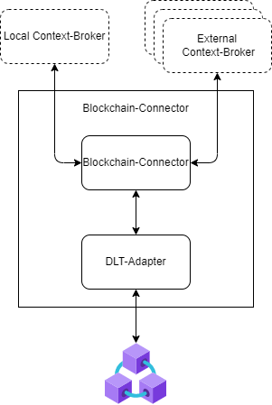

# The DOME Access-Node

[](https://opensource.org/licenses/Apache-2.0)
[](https://github.com/DOME-Marketplace/access-node/actions/workflows/test.yaml)

The DOME Access-Node is a set of microservices, that provides access to the [DOME Marketplace](https://dome-marketplace.org). A registered participant 
can use it to act as a federated marketplace in DOME.
 
> :bulb: For detailed information on how to integrate with the DOME Marketplace, check the [Integration Guide](https://github.com/DOME-Marketplace/integration-guide)

## Components

The DOME Access-Node consists of multiple open-source components. The components are not required to be used, as long as alternatives providing the same interfaces are used. 

The Access-Nodes consists of 3 logical building blocks: 


### TM Forum API

An implementation of the [TMForum APIs](https://www.tmforum.org/oda/open-apis/). The TMForum serves as the main API for Marketplace implementations to interact with. 
Its recommended to use the [FIWARE TMForum API Implementation](https://github.com/FIWARE/tmforum-api), at the moment no working alternatives are known. 

### NGSI-LD Context Broker

The Context Broker serves as the (Off-Chain) Storage Backend for the TMForum-APIs and as a connection mechanism between different Access-Nodes to retrieve the actual data. 
Its recommended to use the [Scorpio Context Broker](https://github.com/ScorpioBroker/ScorpioBroker). Known alternatives are [Orion-LD](https://github.com/FIWARE/context.Orion-LD) and [Stellio](https://github.com/stellio-hub/stellio-context-broker). Depending on the individual scaling requirements and available exierence with the components, the best fitting solution can be used.

The provided Access-Node Chart supports the usage of Scorpio in an resource-friendly installation(therefor without Kafka). For most installations, this should be powerful enough. In case of additional needs, please check the [official Scorpio Documentation](https://scorpio.readthedocs.io/en/latest/).

> :bulb: The Scorpio installation uses [PostgreSQL](https://www.postgresql.org/) with the [Postgis](https://postgis.net/) as storage backend. Its can be replaced with any compatible alternative.

### Blockchain-Connector

The Blockchain-Connector is responsible for publishing and retrieving all change-events for the DOME Marketplace from the Blockchain. Its consists of 3 microservices:



* [Blockchain-Connector](https://github.com/in2workspace/desmos):
  * listens for changes events from the local broker and the DLT-Adapter (subscription)
  * receives events from the local broker and the DLT-Adapter
  * generates the blockchain events and writes them to the DLT-Adapter
  * resolves blockchain events and retrieves the actual entities from their source, writes them to the Context Broker 
  * writes entities from the Blockchain-Connector to the local broker
  * audit any transaction processed by the Blockchain-Connector and writes them to the local database.
* [DLT-Adapter](https://github.com/alastria/DOME-blockchain_connector-dlt_interface):
    * listens for DOME Events and notifies the Blockchain-Connector
    * writes transactions with events received from the Blockchain-Connector to the blockchain
    * retrieves transactions from the blockchain using a range of time parameter, and notifies the Blockchain-Connector

There are no known alternatives to the components at the moment. 

> :bulb: The Blockchain-Connector uses [PostgreSQL](https://www.postgresql.org/) as a storage backend. Its can be replaced with any compatible alternative. While its possible to reuse the same instance as the broker, its recommended to seperate concerns and use 2 different instances.

## Deployment

Its recommended to install the Access-Node on [Kuberentes(> 1.26.7)](https://kubernetes.io/), using [Helm](https://helm.sh/). For alternative installations, see the individual components documentation.

> :bulb: An example of a federated marketplace, deployed on top of a[managed Kubernetes by IONOS](https://dcd.ionos.com/) can be found in [DOME-Gitops](https://github.com/DOME-Marketplace/dome-gitops)  

### Install

The Access-Node is provided as an [Umbrella Chart](https://helm.sh/docs/howto/charts_tips_and_tricks/#complex-charts-with-many-dependencies), containing dependencies to all mentioned [components](#components), allowing to install them all at once:

```shell
helm repo add dome-access-node https://dome-marketplace.github.io/access-node
helm install <RELEASE_NAME> dome-access-node/access-node
```
> :bulb: All releases of the Access-Node reside in the helm-repository https://dome-marketplace.github.io/access-node. In additon to that, all Pre-Release versions(build from the Pull Requests) are provided in the pre-repo https://dome-marketplace.github.io/access-node/pre. The pre-repo will be cleaned-up from time to time, in order to keep the index manageable.

It provides a sane set of default-values. To actually use the Access-Node the following values have to be replaced:

* `blockchain-connector.deployment.blockchain.userEthereumAddress`: Address of the access-node operator on the blockchain.
* `blockchain-connector.deployment.broker.externalDomain`: Externally accessible address of the context broker. Will be used by the other Access-Nodes
* `blockchain-connector.deployment.operator.organizationId`: DID of the marketplace operator
* `dlt-adapter.deployment.privateKey`: Private Key of the access-node operator, has to match the `blockchain-connector.deployment.blockchain.userEthereumAddress` and will be used to sign the transactions

## Test

The Helm-Chart is integration-tested with a local [k3s-instance](https://k3s.io/). 

The test uses the following tools:

* templated by [Helm](https://helm.sh), using the [Helm Maven-Plugin](https://github.com/kokuwaio/helm-maven-plugin)
* deployed with the [k3s Maven-Plugin](https://github.com/kokuwaio/k3s-maven-plugin)
* tested with [Cucumber](https://cucumber.io/)

The test-setup looks as following:


The TMForum-APIs are mapped to local ports:
* provider: localhost:8080
* consumer: localhost:8081

### Run the tests

To execute all tests, run:

```shell
    mvn clean integration-test
```

### Extend the tests

The definition of features is available under the [test-resources](./it/src/test/resources/it/). Steps can be added to the [StepDefinitions](./it/src/test/java/org/dome/accessnode/it/StepDefinitions.java) or through a new class. Rest-Clients to all TMForum-APIs are generated and can be used inside the tests:
```java
var serviceCatalogApiProvider = new ServiceCatalogApi();
// base address of the local provider tmforum-api
serviceCatalogApiProvider = setCustomBaseUrl("http://localhost:8080/tmf-api/serviceCatalogManagement/v4");

var serviceCatalogApiConsumer = new ServiceCatalogApi();
// base address of the local consumer tmforum-api
serviceCatalogApiConsumer = setCustomBaseUrl("http://localhost:8081/tmf-api/serviceCatalogManagement/v4");
```

## CI

The Access-Node repository uses a CI-Pipeline to deliver the Helm-Chart as a tested and versioned component. 

The CI is setup as following:
* integration-tests are executed on every push
* on every PR to ```main```, the CI checks if anything inside the ```/charts/access-node``` folder was changed
    * if false: skip release and allow merging to main
    * if true: 
        * generate the new version, based on the tag assigned to the PR(patch,minor,major)
        * set the version to the Chart.yaml, postfixed with ```-PRE-<PR_NUMBER>``` following the [SemVer 2.0 Spec](https://semver.org/)
        * generate the updated documentation
        * add the chart to the pre-repo(https://dome-marketplace.github.io/access-node/pre)
* on push-to-main(e.g. merged PR), the CI checks if anything inside the ```/charts/access-node``` folder was changed
    * if false: skip release and allow merging to main
    * if true: 
        * generate the new version, based on the tag assigned to the PR(patch,minor,major)
        * set the version to the Chart.yaml
        * generate the updated documentation
        * add the chart to the helm-repo(https://dome-marketplace.github.io/access-node)
        * create a tag and a github release
