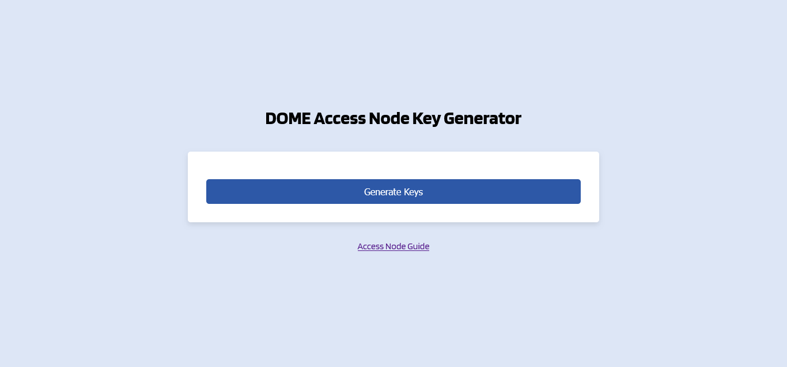
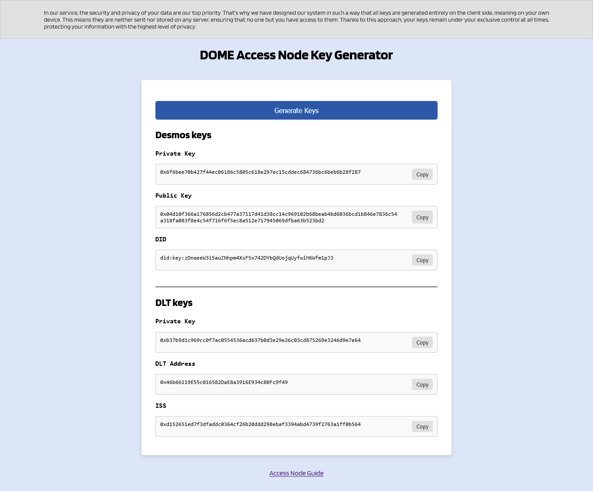

# The DOME Access-Node

[](https://opensource.org/licenses/Apache-2.0)
[](https://github.com/DOME-Marketplace/access-node/actions/workflows/test.yaml)

The [DOME Access-Node](https://github.com/DOME-Marketplace/access-node) is a set of services for the integration with
the DOME Marketplace. A registered participant can use it to act as a federated marketplace in DOME.

## Components

The DOME Access-Node consists of multiple open-source components. The components are not required to be used, as long as
alternatives providing the same interfaces are used.

The Access-Nodes consists of 3 logical building blocks:


### TM Forum API

An implementation of the [TMForum APIs](https://www.tmforum.org/oda/open-apis/). The TMForum serves as the main API for
Marketplace implementations to interact with.

The TM-Forum-API Service is a service providing a growing subset of
the [TMForum API](https://www.tmforum.org/oda/open-apis/table)'s while using
an [NGSI-LD](https://www.etsi.org/deliver/etsi_gs/CIM/001_099/009/01.06.01_60/gs_CIM009v010601p.pdf) context broker as
persistence backend and change notificator.

### NGSI-LD Context Broker

The Context Broker serves as the (Off-Chain) Storage Backend for the TMForum-APIs and as a connection mechanism between
different Access-Nodes to retrieve the actual data.
It's recommended to use the [Scorpio Context Broker](https://github.com/ScorpioBroker/ScorpioBroker).

The provided Access-Node Chart supports the usage of Scorpio in a resource-friendly installation (therefore without
Kafka). For most installations, this should be powerful enough. In case of additional needs, please check
the [official Scorpio Documentation](https://scorpio.readthedocs.io/en/latest/).

> :bulb: The Scorpio installation uses [PostgreSQL](https://www.postgresql.org/) with
> the [PostGIS](https://postgis.net/) as storage backend.

### Blockchain-Connector

The Blockchain Connector is a software component that facilitates the
interaction between the Off-Chain Storage (Context Broker) and the
On-Chain Storage (Blockchain).
It is composed of the Distributed Ledger Technology (DLT) and the Replication Service.
Components:


* [Blockchain-Connector (Replication Service)](https://github.com/in2workspace/desmos):
    * listens for changes events from the local broker and the DLT-Adapter (subscription)
    * receives events from the local broker and the DLT-Adapter
    * generates the blockchain events and writes them to the DLT-Adapter
    * resolves blockchain events and retrieves the actual entities from their source, writes them to the Context Broker
    * writes entities from the Blockchain-Connector to the local broker
    * audit any transaction processed by the Blockchain-Connector and writes them to the local database.
    * synchronizes data with the entities with the genesis node or the selected nodes
* [DLT-Adapter](https://github.com/alastria/DOME-blockchain_connector-dlt_interface):
    * listens for DOME Events and notifies the Blockchain-Connector
    * writes transactions with events received from the Blockchain-Connector to the blockchain
    * retrieves transactions from the blockchain using a range of time parameter, and notifies the Blockchain-Connector

There are no known alternatives to the components at the moment.

> :bulb: The Blockchain-Connector uses [PostgreSQL](https://www.postgresql.org/) as a storage backend. It can be
> replaced with any compatible alternative. While its possible to reuse the same instance as the broker, it's
> recommended
> to separate concerns and use 2 different instances.

## Deployment

> :bulb: For detailed information on how to integrate with the DOME Marketplace, check
> the [Integration Guide](https://github.com/DOME-Marketplace/integration-guide)

It's recommended to install the Access-Node on [Kubernetes(> 1.26.7)](https://kubernetes.io/),
using [Helm](https://helm.sh/). For alternative installations, see the individual components' documentation.

> :bulb: An example of a federated marketplace, deployed on top of
> a [managed Kubernetes by IONOS](https://dcd.ionos.com/) can be found
> in [DOME-Gitops](https://github.com/DOME-Marketplace/dome-gitops)

### Install

The Access-Node is provided as
an [Umbrella Chart](https://helm.sh/docs/howto/charts_tips_and_tricks/#complex-charts-with-many-dependencies),
containing dependencies to all mentioned [components](#components), allowing to install them all at once:

```shell
helm repo add dome-access-node https://dome-marketplace.github.io/access-node
helm install <RELEASE_NAME> dome-access-node/access-node
```

> :bulb: All releases of the Access-Node reside in the helm-repository https://dome-marketplace.github.io/access-node.

It provides a sane set of default-values. To actually use the Access-Node the following values have to be replaced:

### Overview and subcomponents

The TM-Forum-API service is a cluster of individual services providing one specific API each, enabling the participant
to only run the necessary subset for its use-case.
Apart from offering CRUD operations on the managed entities, the service also enables the subscription to notifications
based on given queries.

The services are stateless and support horizontal scaling, but require an external cache to avoid having inconsistent
caches. Inconsistent caches can result from either changes due to calls to the API, or due to notifications for changes
reported by the underlying persistence. If run in a single instance mode, a local cache is acceptable but for larger
setups a [Redis](https://redis.io/) installation is recommended.

For reasons of convenience, the TM-Forum-API service can be deploying with
an [Envoy API proxy](https://www.envoyproxy.io/) which provides the individual APIs via a single service, routed based
on the path. Another convenient feature is a [RapiDoc](https://rapidocweb.com/) container, that can be deployed with the
TM-Forum-API service that provides an Openapi based API documentation for the deployed services, with the functionality
of querying the API too.

The requirement for the persistence is to be compliant to the NGSI-LD API v1.6 enabling the use of different available
context brokers. The currently recommended Context-Broker for the access node
is [Scorpio](https://github.com/ScorpioBroker/ScorpioBroker), mainly due to good cloud integration and overall support.
The Scorpio context-broker allows a variety of adjustments to cover the operator's specific needs ( e.g. horizontal
scaling utilizing [Kafka](https://kafka.apache.org/)) and uses [Postgresql](https://www.postgresql.org/) as it's
persistence layer. The Postgresql is extended with [PostGIS](https://postgis.net/) for supporting geospatial data.

### Infrastructure requirements

The base memory consumption per deployed pod is listed below but is will increase with the amount of traffic, therefor
should only be used as a rough estimate.

| Service                              | Memory (Mi) |
|--------------------------------------|-------------|
| TM Forum API                         | 250         |
| NGSI-LD Context Broker (Scorpio)     | 400         |
| Persistence Layer (Postgres/PostGIS) | 150         |
| External Cache (Redis)               | 10          |
| ...                                  |             |

### How to deploy

The recommended and endorsed way of deployment is via the provided Helm Chart (optionally wrapped in ArgoCD
Applications).

To deploy the Access Node,
an [Umbrella Helm Chart](https://helm.sh/docs/howto/charts_tips_and_tricks/#complex-charts-with-many-dependencies) can
be used as followed.

#### Previous steps

> [!CAUTION]
> Remember to securely store your private keys since it can't be recovered if lost. Avoid sharing or saving it in
> insecure places, as losing it may mean losing access to important resources. Consider using a secure password manager
> or
> a dedicated secrets vault to keep it safe.

1. Go to the [DOME Key Generator](https://dome-marketplace.github.io/dome-crypto-generator/):
   

2. Click the two buttons to generate the keys:
   

3. Register as a valid organization in the Trusted Access Node List of the corresponding environment following the
   instructions in the [DOME Trust Framework](https://github.com/DOME-Marketplace/trust-framework).

   :bulb: With the following tables you can relate the key names in the Dome Key Generator with the key names in the
   Trusted Access Node List:

   | Trusted Access Node List | DOME Key Generator        | 
   |--------------------------|---------------------------|
   | publicKey                | Desmos keys -> Public Key |
   | dlt_address              | DLT keys -> DLT Address   |

4. Copy the private keys to your Access Node Helm Chart implementation and update the specified fields
   in [How to configure](#how-to-configure) section.
   You have a specific explanation about what you need to add in the Trusted Access Node List
   in: https://github.com/DOME-Marketplace/trust-framework#which-data-is-needed-to-set-a-new-entry-into-the-trusted-access-node-operators-list.

   :bulb: With the following tables you can relate the key names in the Dome Key Generator with the key names in the
   Trusted Access Node List and the Access Node Helm Chart:

   | Access Node Helm Chart                     | DOME Key Generator         |
   |--------------------------------------------|----------------------------|
   | desmos.app.privateKey                      | Desmos keys -> Private Key |
   | desmos.app.operator.organizationIdentifier | Desmos keys -> DID         |
   | dlt-adapter.env.PRIVATE_KEY                | DLT keys -> Private Key    |
   | dlt-adapter.env.ISS                        | DLT keys -> ISS            |

5. Add the DOME Helm Chart Repository to your helm installation

    ```
    helm repo add dome-access-node https://dome-marketplace.github.io/access-node
    helm repo update
     ```

   :bulb: All releases of the Access-Node reside in the
   helm-repository https://dome-marketplace.github.io/access-node.
   In addition to that, all Pre-Release versions(build from the Pull Requests) are provided in the
   pre-repo https://dome-marketplace.github.io/access-node/pre. The pre-repo will be cleaned-up from time to time, in
   order to keep the index manageable.

6. Install the DOME Access Node
    ```
    helm install access-node dome-access-node/access-node --namespace <NAMESPACE> -f config/accessnode.yaml
    ```

   NAMESPACE: The Kubernetes Cluster namespace where the DOME Access Node will be deployed.

### How to configure

The chart is released with a set
of [default values](https://github.com/DOME-Marketplace/access-node/blob/main/charts/access-node/values.yaml) which act
as a good starting point for an adoption. These values are also documented, enhancing the understanding. Additionally,
the of the components should be consulted.

| Component           | Chart                                                                       |
|---------------------|-----------------------------------------------------------------------------|
| TM-Forum-API        | https://github.com/FIWARE/helm-charts/tree/main/charts/tm-forum-api         |
| desmos              | https://github.com/in2workspace/helm-charts/tree/main/charts/desmos         |
| broker-adapter      | https://github.com/in2workspace/helm-charts/tree/main/charts/broker-adapter |
| dlt-adapter         | https://github.com/alastria/helm-charts/tree/master/dlt-adapter             |
| kafka               | https://github.com/bitnami/charts/tree/main/bitnami/kafka                   |
| postgresql          | https://github.com/bitnami/charts/tree/main/bitnami/postgresql              |
| scorpio-broker-aaio | https://github.com/FIWARE/helm-charts/tree/main/charts/scorpio-broker-aaio  |
| scorpio-broker      | https://github.com/FIWARE/helm-charts/tree/main/charts/scorpio-broker       |

#### Basic configuration

To start, use [this](charts/access-node/values.yaml) which includes only the settings likely to need adjustment by
integrators.

1. **Required Fields Generated by the DOME Key Generator**

   The following fields are specific to each integrator and should be generated via
   the [DOME Key Generator](https://dome-marketplace.github.io/dome-crypto-generator/):

   | Key                                                    | Description                          | Explanation                                                                                                                             |
   |--------------------------------------------------------|--------------------------------------|-----------------------------------------------------------------------------------------------------------------------------------------|
   | access-node.desmos.app.operator.organizationIdentifier | DID of the operator                  | The "DID" key generated in the "Desmos keys" part [DOME Key Generator](https://dome-marketplace.github.io/dome-crypto-generator/)       |
   | access-node.desmos.app.privateKey                      | Private key to sign JWT              | The "Private Key" generated in the "Desmos keys" part [DOME Key Generator](https://dome-marketplace.github.io/dome-crypto-generator/)   |
   | access-node.dlt-adapter.env.PRIVATE_KEY                | Private key for transaction signing  | The "Private Key" generated in the "DLT keys" part [DOME Key Generator](https://dome-marketplace.github.io/dome-crypto-generator/)      |
   | access-node.dlt-adapter.env.ISS                        | Organization ID hashed with SHA-256  | The "ISS" generated in the "DLT keys" part [DOME Key Generator](https://dome-marketplace.github.io/dome-crypto-generator/)              |

2. **Custom Required Fields**

   These additional fields must also be specified by integrators:

   | Key                                     | Description                                                                             | Explanation                                        |
   |-----------------------------------------|-----------------------------------------------------------------------------------------|----------------------------------------------------|
   | access-node.desmos.app.profile          | allows the environment filtering                                                        | dev/test/prod (see the desmos profile table below) |
   | access-node.desmos.app.externalDomain   | must be set since it is used by third parties to retrieve your data; it should be https | The external domain you're using to expose Desmos  |

   The Blockchain Connector uses the _dev_, _test_ and _prod_ configuration profiles. On the other hand, DOME uses the
   profile names _sbx_, _dev_ and _prd_. It is important that users use the profile names used by the Blockchain
   Connector
   (_dev_, _test_, _prod_), since the application is responsible for carrying out the necessary correspondence and
   mapping
   between the profile names of the Blockchain Connector and those of DOME automatically.

   | desmos-api profiles | DOME-Gitops environments |
   |:-------------------:|:------------------------:|
   |         dev         |           sbx            |
   |        test         |           dev            |
   |        prod         |           prd            |

#### Additional configuration

Fields to clarify in the original config:

| Key                                                 | Comment                                                       | Default Values                                                                                                                                              |
|-----------------------------------------------------|---------------------------------------------------------------|-------------------------------------------------------------------------------------------------------------------------------------------------------------|
| access-node.desmos.app.ngsiSubscription.entityTypes | this list ensures that you can work with all type of entities | catalog,product-offering,category,individual,organization,product,service-specification,product-offering-price,resource-specification,product-specification |
| access-node.desmos.app.txSubscription.entityTypes   | this list ensures that you can work with all type of entities | catalog,product-offering,category,individual,organization,product,service-specification,product-offering-price,resource-specification,product-specification |

##### Configure custom secrets

While secrets can be configured via plain helm/k8s entities, another more secure approach is to
use [Sealed Secrets](https://github.com/bitnami-labs/sealed-secrets). To configure custom secrets you have to follow the
next steps:

1. **Create a Plain Secret Manifest File:**
    - Create a plain secret manifest file named ```<secret name>-plain-secret.yaml```.
    - **IMPORTANT**: Add "*-plain-secret.yaml" to .gitignore file to not push plain secret data to the repository.

    ```yaml
    apiVersion: v1
    kind: Secret
    metadata:
      name: <secret name>
      namespace: <app namespace>
    data: 
      <secret_key>: <base64 encoded value>
    ```

2. **Seal the secret:**
    - Seal the secret by executing the following command and add it to a "templates" folder:

    ```sh
    kubeseal -f <secret name>-plain-secret.yaml -w <secret name>-sealed-secret.yaml --controller-namespace sealed-secrets --controller-name sealed-secrets
    ```

3. **Update the Chart Values:**
    - In the chart values.yaml file, modify the existingSecret section as follows:

    ```yaml
    existingSecret:  
      enabled: true  
      name: <secret name>  
      key: <secret_key>
    ```

#### How to validate a deployment

All components are configured with health and readiness checks to validate their own status, therefor being the base for
a validation. These checks are utilized in the kubernetes checks as defined in the helm charts.

> TODO: Include RapiDoc Container for validation and add explanation here

#### How to operate

> - Management/admin APIs.
>- Instrumentation, metrics, logs, alerts

The underlying database service holds the persisted data and therefor requires a backup&recovery mechanism when operated
in a production environment. The use of managed database is strongly encouraged for safety and convenience.

The TM-Forum-API service used a json based log output by default, which can be parsed easily by log aggregators but can
also be replaced if needed. The verbosity is controlled
via [environment variables](https://github.com/FIWARE/helm-charts/blob/05552c4c97a21df68f14e78de80a56e3934e179d/charts/tm-forum-api/templates/deployment.yaml#L165)
and can be fine-tuned to the operators needs.

We need to implement Grafana dashboards but for the moment the access node publishes metrics for Prometheus by default
in "/actuator/prometheus".

#### How to update

Upgrade to both a different chart version and new configuration can be accomplished with the following command

  ```
    helm upgrade <RELEASE_NAME> dome-access-node/access-node --namespace <NAME_SPACE> --version <CHART_VERSION> -f values.yaml
  ```

#### Release process

Versioning of the main access-node helm chart is handled based on the labels used in the pull requests used to introduce
changes and is enforced in
the [build pipeline](https://github.com/DOME-Marketplace/access-node/tree/main/.github/workflows). The requester and
reviewers must set the label according to the [SemVer 2.0.0](https://semver.org/) versioning scheme.

Versioning of the components and sub-charts is recommended to use the same scheme.

> Versioning, release notes, stability considerations

#### Troubleshooting

> To be filled once feedback from integrators comes in

##### Timeouts occur while querying TM-Forum-API

When encountering timeouts in calls to the TM-Forum-API service it is possible to mitigate the imminent issue by
increasing the timeout of the client (called "ngsi") calling the NGSI-LD broker. The
necessary [client](https://docs.micronaut.io/latest/guide/configurationreference.html#io.micronaut.http.client.ServiceHttpClientConfiguration)
and [server](https://docs.micronaut.io/latest/guide/configurationreference.html#io.micronaut.http.server.HttpServerConfiguration)
configuration can be handed in
via [additional environment variables](https://github.com/FIWARE/helm-charts/blob/05552c4c97a21df68f14e78de80a56e3934e179d/charts/tm-forum-api/templates/deployment.yaml#L243-L249).

## Test

The Helm-Chart is integration-tested with a local [k3s-instance](https://k3s.io/).

The test uses the following tools:

* templated by [Helm](https://helm.sh), using the [Helm Maven-Plugin](https://github.com/kokuwaio/helm-maven-plugin)
* deployed with the [k3s Maven-Plugin](https://github.com/kokuwaio/k3s-maven-plugin)
* tested with [Cucumber](https://cucumber.io/)

The test-setup looks as following:


The TMForum-APIs are mapped to local ports:

* provider: localhost:8080
* consumer: localhost:8081

### Run the tests

To execute all tests, run:

```shell
    mvn clean integration-test
```

### Extend the tests

The definition of features is available under the [test-resources](./it/src/test/resources/it). Steps can be added to
the [StepDefinitions](./it/src/test/java/org/dome/accessnode/it/StepDefinitions.java) or through a new class.
Rest-Clients to all TMForum-APIs are generated and can be used inside the tests:

```
var serviceCatalogApiProvider = new ServiceCatalogApi();
// base address of the local provider tmforum-api
serviceCatalogApiProvider = setCustomBaseUrl("http://localhost:8080/tmf-api/serviceCatalogManagement/v4");

var serviceCatalogApiConsumer = new ServiceCatalogApi();
// base address of the local consumer tmforum-api
serviceCatalogApiConsumer = setCustomBaseUrl("http://localhost:8081/tmf-api/serviceCatalogManagement/v4");
```

## CI

The Access-Node repository uses a CI-Pipeline to deliver the Helm-Chart as a tested and versioned component.

The CI is set up as following:

* integration-tests are executed on every push
* on every PR to ```main```, the CI checks if anything inside the ```/charts/access-node``` folder was changed
    * if false: skip release and allow merging to main
    * if true:
        * generate the new version, based on the tag assigned to the PR(patch,minor,major)
        * set the version to the Chart.yaml, postfixed with ```-PRE-<PR_NUMBER>``` following
          the [SemVer 2.0 Spec](https://semver.org/)
        * generate the updated documentation
        * add the chart to the pre-repo(https://dome-marketplace.github.io/access-node/pre)
* on push-to-main(e.g. merged PR), the CI checks if anything inside the ```/charts/access-node``` folder was changed
    * if false: skip release and allow merging to main
    * if true:
        * generate the new version, based on the tag assigned to the PR(patch,minor,major)
        * set the version to the Chart.yaml
        * generate the updated documentation
        * add the chart to the helm-repo(https://dome-marketplace.github.io/access-node)
        * create a tag and a GitHub release
